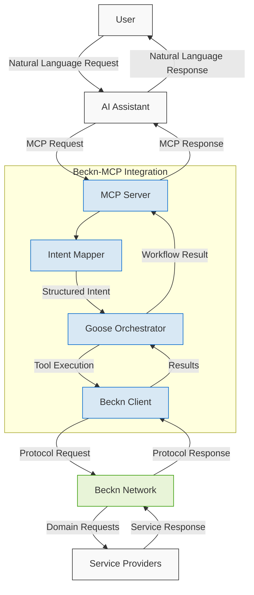

# Beckn-MCP Integration

A bridge between AI systems (via the Model Context Protocol) and Beckn's interoperable transaction networks.



## Project Overview

This project implements a server that enables AI assistants to interact with real-world services through Beckn Protocol networks. It uses Model Context Protocol (MCP) to receive requests from AI models and supports pluggable orchestration frameworks.

### Key Components

- **MCP Server**: Handles MCP protocol requests from AI systems
- **Intent Mapper**: Translates natural language intents to Beckn operations
- **Orchestration Layer**: Manages workflows with pluggable engines (Goose, MindNet, etc.)
- **Beckn Client**: Interacts with Beckn networks following the protocol

## Getting Started

### Prerequisites

- Node.js (v18+)
- TypeScript
- Docker (optional, for containerized deployment)

### Installation

1. Clone this repository
```bash
git clone https://github.com/yourusername/mcp-beckn.git
cd mcp-beckn
```

2. Install dependencies
```bash
npm install
```

3. Configure environment
```bash
cp .env.example .env
# Edit .env with your configuration
```

4. Start the development server
```bash
npm run dev
```

## Architecture

The system follows a modular architecture with clear separation of concerns:

1. AI assistants send requests via MCP
2. Intent mapping transforms natural language to structured intents
3. Pluggable orchestration manages the transaction workflow
4. Beckn client handles protocol-specific operations

For more details, see the [Technical Proposal](./docs/technical-proposal.md).

## Orchestration Engines

The system supports multiple orchestration engines that can be configured via the `ORCHESTRATOR_TYPE` environment variable:

- **Goose** (default): Block's workflow orchestration framework
- **MindNet**: Memory-persistent, Knowledge Graph-driven orchestration (placeholder)
- **LangGraph**: LangChain's graph-based workflow engine (placeholder)
- **Custom**: Create and plug in your own orchestration engine

To create your own orchestrator:

```bash
# Generate boilerplate for a new orchestrator
node scripts/create-orchestrator.js MyOrchestrator

# Configure to use it
echo "ORCHESTRATOR_TYPE=my-orchestrator" >> .env

# Run with your custom orchestrator
npm run dev
```

See [Custom Orchestrators Guide](./docs/custom-orchestrators.md) for detailed instructions.

## Quick Demo

```bash
# Clone and start the project
git clone https://github.com/yourusername/mcp-beckn.git
cd mcp-beckn
npm install
npm run dev

# In another terminal, test with a sample request:
curl -X POST http://localhost:3000/mcp/v1 \
  -H "Content-Type: application/json" \
  -d '{"query": "Book me a cab from MG Road to the airport", "context": {"user_id": "user123"}}'
```

## Development Roadmap

- **Phase 1** (Current): Basic MCP server with Beckn search capabilities
- **Phase 2** (Q2 2025): Full transaction lifecycle support (search, select, init, confirm)
- **Phase 3** (Q3 2025): Multi-domain support and advanced NLU
- **Phase 4** (Q4 2025): Production-ready implementation with real Beckn network integration

## Contributing

This project is in early development and welcomes contributions. Please read [CONTRIBUTING.md](./CONTRIBUTING.md) for details on our code of conduct and the process for submitting pull requests.

## License

This project is licensed under the MIT License - see the [LICENSE](LICENSE) file for details.

## Acknowledgments

- Beckn Protocol community
- Anthropic for the Model Context Protocol
- Block for the Goose orchestration framework
